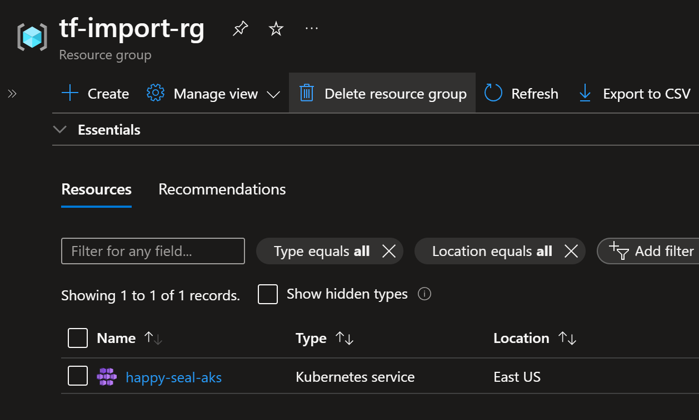
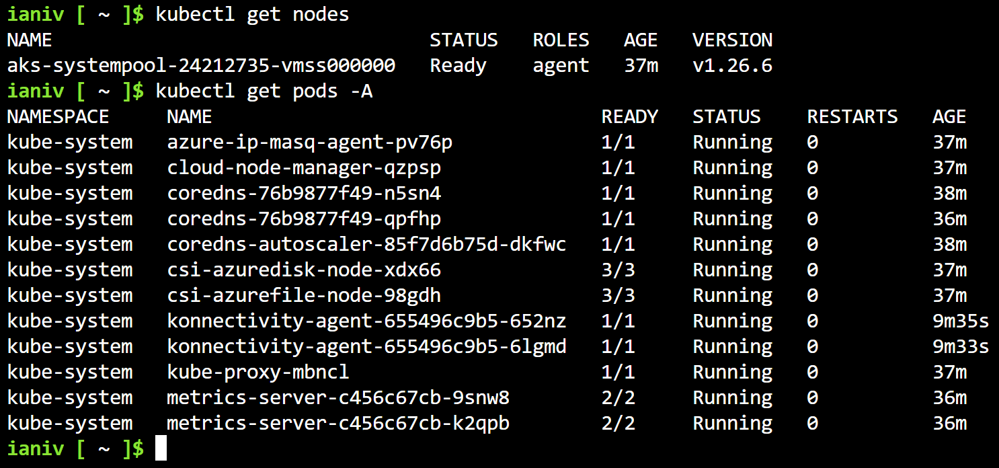
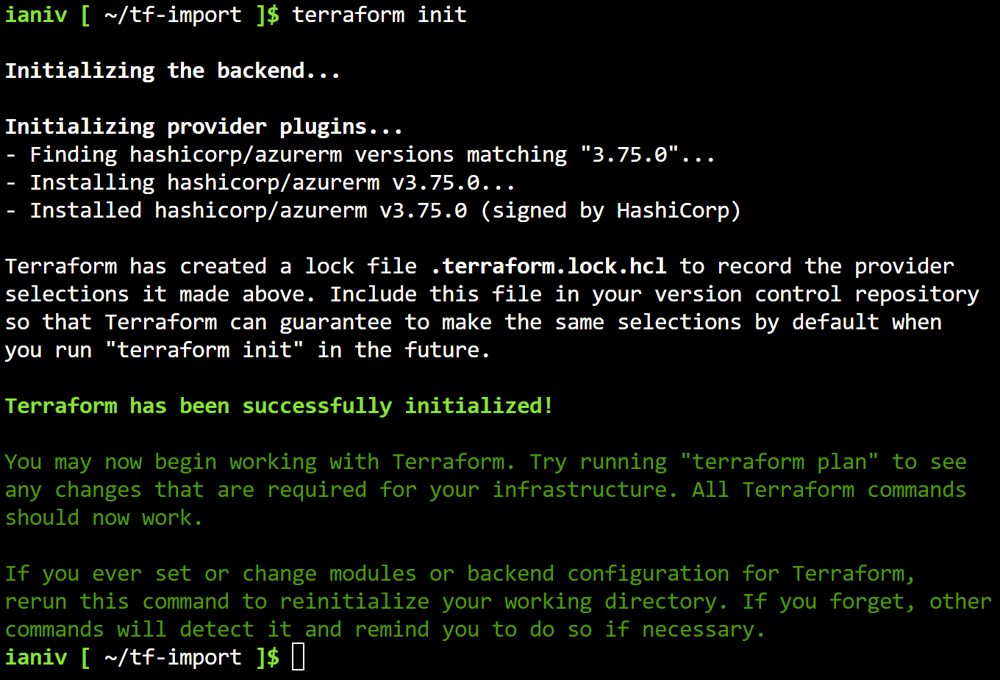
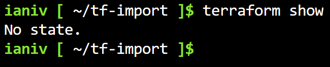
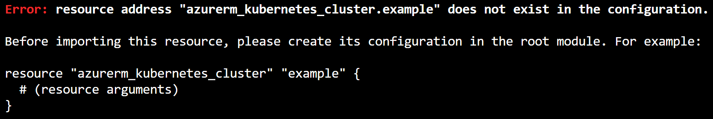
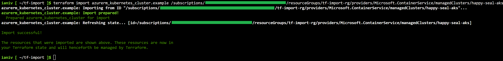
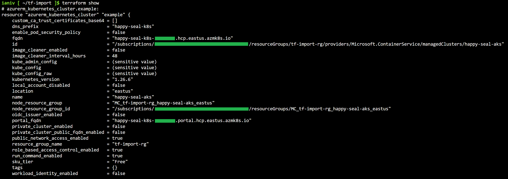

# Terraform
## Import command

In this guide (based on the official one: https://github.com/hashicorp/learn-terraform-import) I'm putting Terraform Import command out for a test with a manually created AKS cluster: a great option to bring existing resources under Terraform management.

---

- Manually created AKS cluster:





1. Create the working directory:

```shell
mkdir tf-import && cd "$_"
```

2. Create the provider configuration file:

```shell
cat << EOF > config.tf
# Terraform 0.13+
# Declare Terraform Block configuration

terraform {
  required_providers {
    azurerm = {
      source = "hashicorp/azurerm"
      version = "3.75.0"
    }
  }
}

# Declare Provider Requirements

provider "azurerm" {

  features {}

}
EOF
```

3. Initialize Terraform:

```shell
terraform init
```



Great, the working directory was initialized but the resource configuration and state files are pending. 



4. Create the empty configuration file for the cluster resource. This will be the file that later on will handle the cluster changes:

```shell
echo 'resource "azurerm_kubernetes_cluster" "example" {}' > import.tf
```

Note: This is mandatory before importing the configuration, otherwise the error below will be displayed:



5. Run the `import` command (replace *subId* and cluster name accordingly):

```shell
terraform import azurerm_kubernetes_cluster.example /subscriptions/<subId>/resourceGroups/tf-import-rg/providers/Microsoft.ContainerService/managedClusters/happy-seal-aks
```



6. Verify that resource parameters were successfully imported in the state file: 

```shell
terraform show
```



7. Parse the state contents into the `import.tf` file: 

```shell
terraform show -no-color > import.tf 
```

8. Done, now the `import.tf` file contains the imported parameters and can be further configured with the arguments from the Terraform documentation:

https://registry.terraform.io/providers/hashicorp/azurerm/latest/docs/resources/kubernetes_cluster

9. Running the `plan` command at this point will throw Errors and Warnings (this is mentioned in the official doc). So, `sed` to the rescue:

```bash
terraform plan
sed -i -e '10,12d' import.tf

terraform plan
sed -i -e '5,7d;15d;17d;35d;37d;57,58d;86,93d' import.tf

terraform plan
sed -i -e '15d' import.tf
```

After a couple of cleaning cycles I was able to go through and successfully manage the cluster with Terraform.